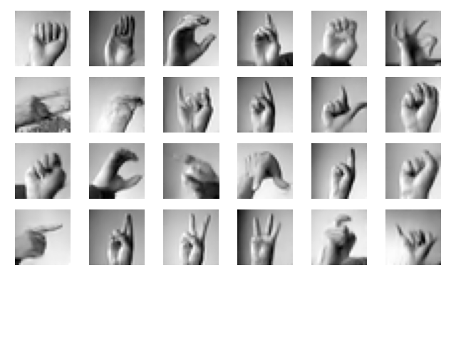

# Conditional DDPM sign languange MNIST

A compact implementation of a DDPM model based on [this repository](https://github.com/TeaPearce/Conditional_Diffusion_MNIST/tree/main), with a denoising UNet inspired by [U-Net Transformer paper](https://arxiv.org/pdf/2103.06104)

Example samples produced by the model.

 
Based on a [Kaggle sign language dataset](https://www.kaggle.com/datasets/datamunge/sign-language-mnist)
